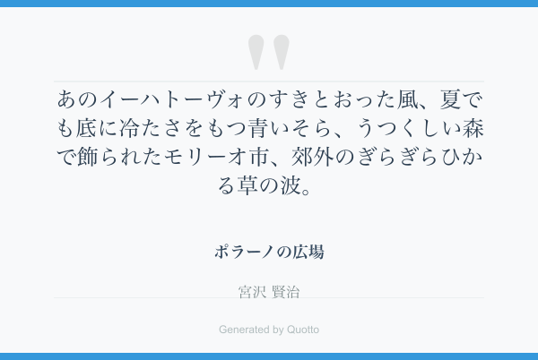

# Quotto - Beautiful Quote Image Generator

A CLI tool to generate beautiful quote images inspired by e-reader aesthetics, built with TypeScript, Bun, and Ink.

[](https://github.com/taross-f/quotto/actions/workflows/ci.yml)
[](https://github.com/taross-f/quotto/actions/workflows/publish.yml)


## Motivation

When using e-readers like Kindle, you can easily share highlights from books managed by Amazon. However, for books not managed by Amazon (such as personal PDFs, documents sent via "Send to Kindle", or books from other sources), the highlight sharing feature is not available. Quotto fills this gap by allowing you to create beautiful, shareable quote images from any text, maintaining the clean aesthetic of e-reader interfaces.

## Features

- 📚 Generate beautiful quote images with customizable text
- 🎨 Clean, minimalist design inspired by e-reader interfaces
- 📝 Support for multiline quotes with `\n` escape sequences
- ⚡ Fast execution with Bun runtime
- 🎯 Interactive CLI with Ink React components
- 🧪 Comprehensive test coverage with TDD approach

## Installation

### Install from NPM

```bash
# Install globally
npm install -g quotto

# Or install locally in your project
npm install quotto
```

### Install from source

```bash
git clone https://github.com/taross-f/quotto.git
cd quotto
npm install
```

### Development setup

```bash
# Install dependencies
bun install

# Run tests
bun test

# Run linter
bun run lint

# Start development mode
bun run dev
```

## Usage

### Basic usage

```bash
# If installed globally
quotto --quote "Your inspiring quote here"

# If installed locally
npx quotto --quote "Your inspiring quote here"
```

### With all options

```bash
quotto \
  --quote "Innovation distinguishes\nbetween a leader and a follower." \
  --title "Various Interviews" \
  --author "Steve Jobs" \
  --output "my-quote.png"
```

### Command options

- `--quote` (required): The quote text to display. Supports `\n` for line breaks
- `--title` (optional): Book or source title. Supports `\n` for line breaks
- `--author` (optional): Author name. Supports `\n` for line breaks
- `--output` (optional): Output filename (default: `quotto-quote-[timestamp].png`)
- `--help, -h`: Show help message

### Examples

```bash
# Simple quote
quotto --quote "The only way to do great work is to love what you do."

# Quote with attribution
quotto \
  --quote "Stay hungry,\nstay foolish." \
  --title "Stanford Commencement Address" \
  --author "Steve Jobs"

# Custom output filename
quotto \
  --quote "Your time is limited,\ndon't waste it living someone else's life." \
  --output "inspirational.png"
```

## Development

### Project structure

```
quotto/
├── src/
│   ├── cli.tsx           # Main CLI interface with Ink
│   ├── cli-parser.ts     # Command line argument parser
│   └── image-generator.ts # SVG-based image generation
├── tests/
│   ├── cli.test.ts       # CLI parser tests
│   ├── image-generator.test.ts # Image generation tests
│   └── setup.test.ts     # Test setup verification
├── biome.json           # Biome linter configuration
├── tsconfig.json        # TypeScript configuration
└── package.json         # Project dependencies
```

### Testing

The project follows Test-Driven Development (TDD) principles:

```bash
# Run all tests
bun test

# Run specific test file
bun test tests/cli.test.ts

# Watch mode
bun test --watch
```

### Code quality

Using Biome for linting and formatting:

```bash
# Check code quality
bun run lint

# Fix lint issues
bun run lint:fix

# Format code
bun run format
```

## Output

Quotto generates PNG images with:
- Clean, minimalist design
- Customizable quote text with automatic word wrapping
- Optional book title and author attribution
- Subtle branding elements
- High-quality rendering using Sharp

### Example Output



*Example quote image generated with Quotto*

## License and Disclaimer

This project is provided as-is for educational and personal use.

**⚠️ Important Notice:**
- This software is provided "AS IS" without warranty of any kind
- Users are responsible for their own use of this tool
- The maintainers assume no responsibility for how the tool is used
- Management and deployment of this tool is entirely at the user's own risk
- Users must ensure compliance with all applicable laws and regulations
- Any consequences arising from the use of this tool are the sole responsibility of the user

## Contributing

Contributions are welcome! Please:
1. Fork the repository
2. Create a feature branch
3. Write tests for new functionality
4. Ensure all tests pass
5. Submit a pull request
